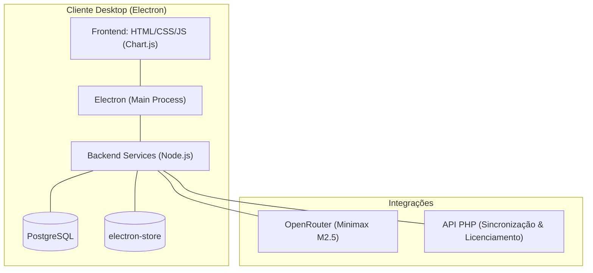

# 📊 UniCloud Inteligência Financeira

Dashboard desktop para análise de custo operacional e conciliação de faturamento integrado com Inteligência Artificial.

---

## 🏛️ Arquitetura do Sistema



### Tecnologias

* **Electron** (Multiplataforma Desktop)
* **Node.js** (Serviços e APIs locais)
* **PostgreSQL** (Armazenamento relacional e cache)
* **electron-store** (Persistência local de despesas manuais)
* **OpenRouter API** (Integração com LLM)
* **PHP** (API de sincronização externa)

---

## 📂 Estrutura do Repositório

```directory
├── backend/                # Lógica e serviços de negócio (Node.js)
│   ├── ai_service.js       # Orquestrador do Agente de IA
│   ├── db.js               # Pooling e queries (PostgreSQL)
│   └── manual_expense_s... # CRUD local (electron-store)
├── electron/               # Inicialização nativa do Electron
├── frontend/               # Dashboard web (HTML/CSS/JS)
└── scripts/                # Scripts utilitários de suporte
```

---

## ⚡ Setup Local

### Pré-requisitos
* Node.js v18+
* PostgreSQL v14+
* PHP 8.0+

### Configuração e Execução

1. **Instalar dependências:**
   ```bash
   npm install
   ```

2. **Configurar variáveis de ambiente:**
   ```bash
   cp .env.example .env
   ```

3. **Executar em desenvolvimento:**
   ```bash
   npm start
   ```

4. **Compilar build de produção (Windows):**
   ```bash
   npm run build
   ```
