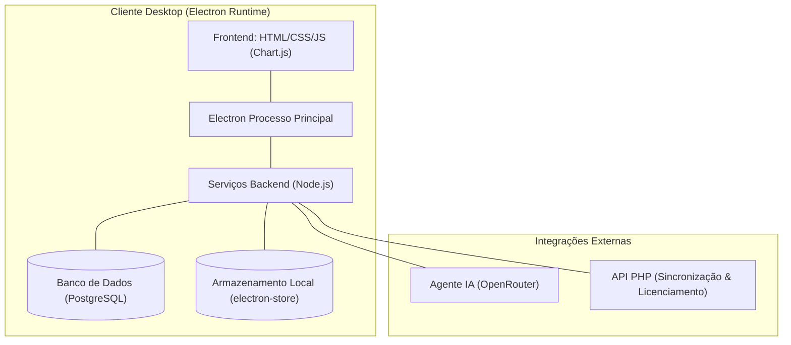

# 📊 UniCloud Inteligência Financeira

> **Dashboard Corporativo de Análise Financeira, Custo Operacional e Inteligência Artificial**

---

## 💻 Sobre o Projeto

O **UniCloud Inteligência Financeira** é um sistema completo de gestão e análise de custos operacionais, desenvolvido sob os mais rigorosos padrões de engenharia de software para proporcionar controle absoluto sobre as finanças de médias e grandes empresas.

A aplicação combina dados consolidados diretamente do ERP com a flexibilidade de cadastros locais de planos de contas e despesas manuais. Além disso, conta com um **Agente de Inteligência Artificial** integrado, capaz de diagnosticar gargalos de despesas, prever desvios orçamentários e oferecer insights estratégicos detalhados.

---

## 🏛️ Arquitetura do Sistema

O sistema é construído sobre uma arquitetura híbrida projetada para ser resiliente, rápida e independente de conexão contínua obrigatória com a nuvem:



### Tecnologias Utilizadas

| Camada | Tecnologia | Propósito / Função |
| :--- | :--- | :--- |
| **Container Desktop** | `Electron (v42.0+)` | Empacotamento de aplicação nativa multiplataforma (Windows) |
| **Interface do Usuário** | `HTML5, CSS3 (Vanilla), JS` | UI ultra responsiva, animações em micro-interações |
| **Visualização de Dados** | `Chart.js` | Gráficos interativos de pizza, linhas e barras para análise de fluxo |
| **Efeitos Visuais** | `Vanilla-Tilt` | Efeitos premium de glassmorphism e profundidade 3D nos cards |
| **Banco de Dados Relacional** | `PostgreSQL` | Repositório robusto para cache de dados do ERP e históricos pesados |
| **Banco de Dados Local** | `electron-store` | Persistência ultra veloz e segura para despesas e planos de contas manuais locais |
| **Motor de Inteligência** | `OpenRouter API` | Conexão de baixa latência a Large Language Models (LLM) |
| **Serviço de Sincronização**| `PHP (API)` | Camada externa de autenticação, recebimento de dados e reconciliação |

---

## 📂 Estrutura do Repositório

```directory
├── api/                    # API de sincronização baseada em PHP
│   ├── admin/              # Painel administrativo de controle de licenças
│   ├── data/               # Diretório reservado para backups locais
│   ├── setup.php           # Script de provisionamento de banco/tabelas da API
│   ├── receive.php         # Endpoint receptor para dados ERP
│   └── auth_agent.php      # Utilitário de autenticação e validação de chaves
├── backend/                # Serviços de negócio locais do App (Node.js)
│   ├── ai_service.js       # Orquestrador do Agente de IA Financeira
│   ├── db.js               # Conexão e pooling do PostgreSQL
│   ├── stock_intelligence_s# Módulo de inteligência de estoque e inventário
│   └── manual_expense_s... # CRUD local para despesas manuais (electron-store)
├── electron/               # Código de inicialização e ciclo de vida nativo
│   ├── main.js             # Processo principal do Electron
│   ├── preload.js          # IPC Bridge seguro entre Frontend e Backend
│   └── icon.png            # Identidade visual da aplicação compilada
├── frontend/               # Interface web renderizada no Electron
│   ├── index.html          # Estrutura principal do Dashboard
│   ├── styles.css          # Design System e folha de estilos premium
│   ├── ai_styles.css       # Estilização dedicada ao Chat do Assistente IA
│   └── dashboard.js        # Controller, renderizador de gráficos e chamadas IPC
├── scripts/                # Scripts utilitários de suporte e automação
└── dist/                   # Artefatos finais gerados no build produtivo (ignorado no Git)
```

---

## ⚡ Preparação do Ambiente & Inicialização

Siga este passo a passo para configurar e rodar o projeto localmente em ambiente de desenvolvimento.

### Pré-requisitos
* **Node.js** (versão 18.x ou superior recomendada)
* **PostgreSQL** (configurado localmente ou em servidor acessível)
* **PHP 8.0+** (necessário para rodar a API externa de sincronização, se desejado)

### 1. Clonando o Repositório e Instalando Dependências
```bash
# Clone o repositório
git clone https://github.com/seu-usuario/despesas-x-faturamento.git

# Acesse o diretório
cd despesas-x-faturamento

# Instale todas as dependências de desenvolvimento e produção
npm install
```

### 2. Configurando as Variáveis de Ambiente
Copie o arquivo de exemplo `.env.example` para criar a sua configuração local:
```bash
cp .env.example .env
```
Abra o arquivo `.env` e configure de acordo com o seu banco local:
```env
DB_USER=postgres
DB_PASSWORD=sua_senha
DB_HOST=localhost
DB_PORT=5432
DB_NAME=unico
API_BASE_URL=http://localhost/dashboard1/api
RESET_SYNC=true
OPENROUTER_API_KEY=sua_chave_openrouter
AI_MODEL=minimax/minimax-m2.5:free
```


### 3. Rodando em Modo de Desenvolvimento
```bash
# Inicializa o Electron apontando para o ambiente configurado
npm start
```

### 4. Build de Produção
Para compilar o executável nativo otimizado para Windows:
```bash
npm run build
```
O artefato final empacotado estará localizado no diretório `/dist`.

---

## 🧠 Recursos de Destaque

### 1. Consolidação de Origens Mistas (ERP + Manual)
O Dashboard unifica os dados oficiais importados do ERP com despesas locais lançadas de forma independente. Isso permite fazer simulações financeiras ("E se...") sem corromper ou misturar os registros oficiais de auditoria do banco de dados central.

### 2. Agente de Análise Financeira (IA)
Nosso agente cognitivo integrado analisa a saúde operacional da empresa baseado nas contas manuais e consolidadas, respondendo a perguntas no chat local, identificando tendências de aumento de custos, anomalias de faturamento e sugerindo otimizações baseadas em modelos avançados de IA (OpenRouter).

### 3. Interface com Glassmorphism Premium
Layout moderno, escuro e agradável, construído com foco na ergonomia visual de analistas financeiros que utilizam a ferramenta por horas consecutivas. Gráficos dinâmicos com tempo de transição suave e cards com comportamento interativo baseado no movimento do mouse.


